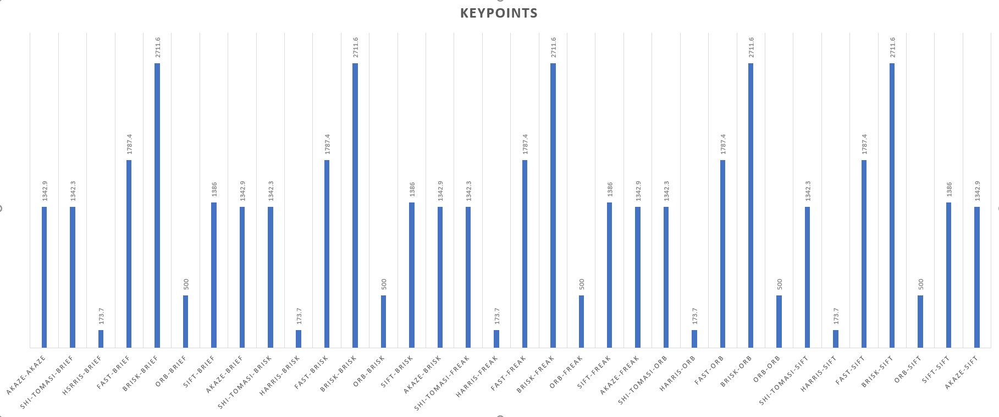
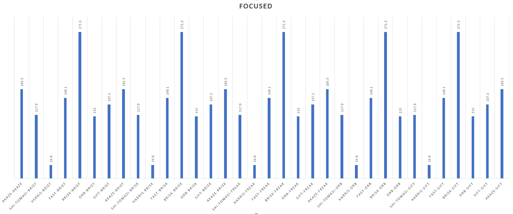
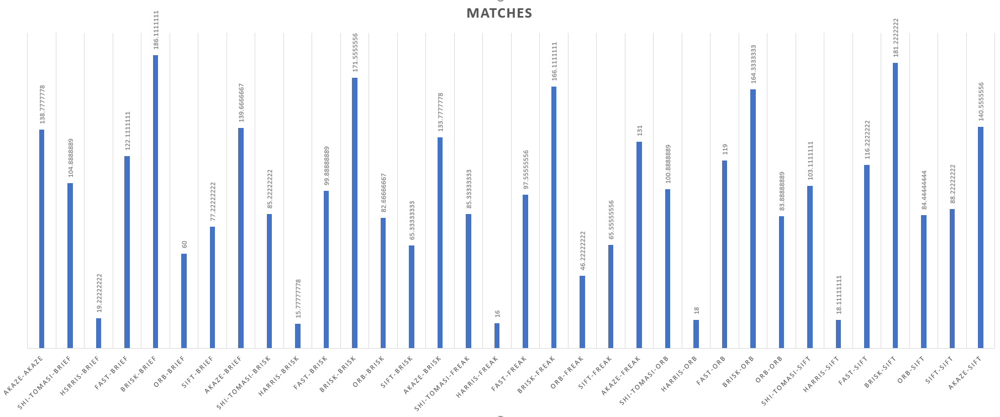
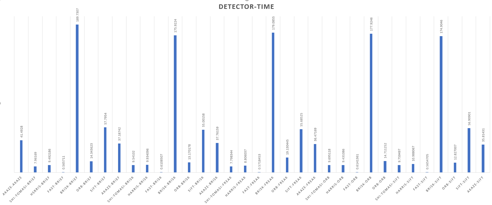
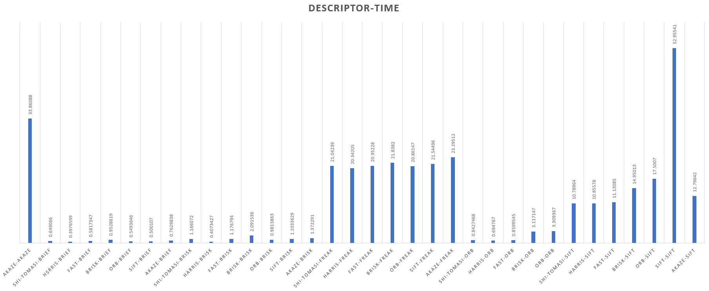
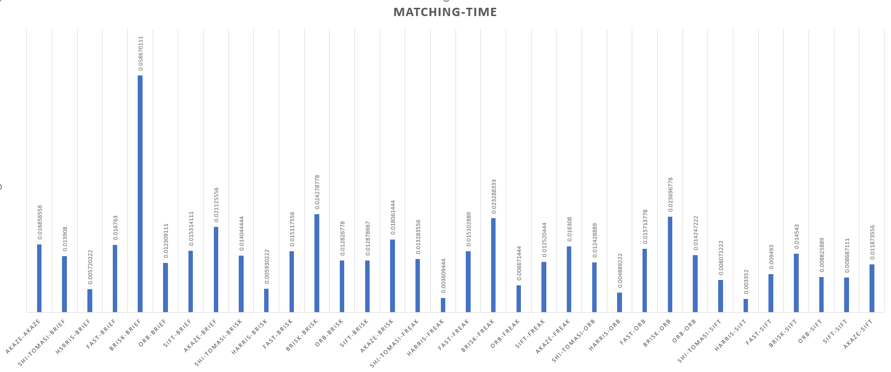
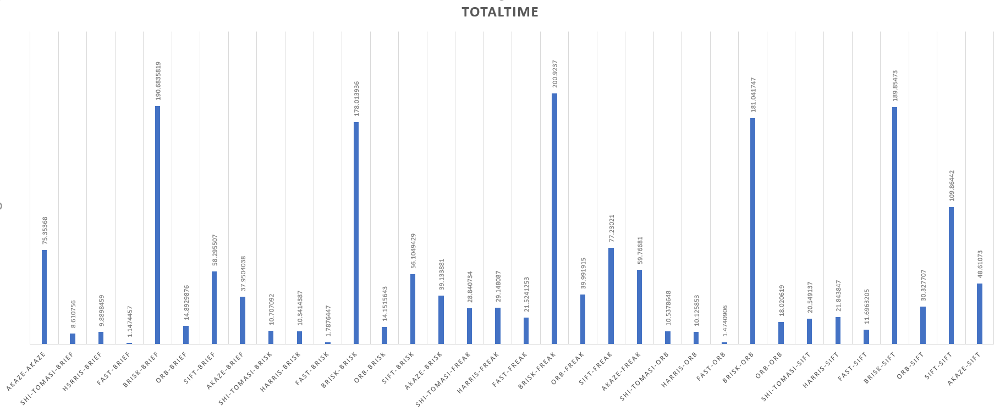

# SFND 2D Feature Tracking

The idea of the camera course is to build a collision detection system - that's the overall goal for the Final Project. As a preparation for this, you will now build the feature tracking part and test various detector / descriptor combinations to see which ones perform best. This mid-term project consists of four parts:

* First, you will focus on loading images, setting up data structures and putting everything into a ring buffer to optimize memory load. 
* Then, you will integrate several key point detectors such as HARRIS, FAST, BRISK and SIFT and compare them with regard to number of key points and speed. 
* In the next part, you will then focus on descriptor extraction and matching using brute force and also the FLANN approach we discussed in the previous lesson. 
* In the last part, once the code framework is complete, you will test the various algorithms in different combinations and compare them with regard to some performance measures. 

See the classroom instruction and code comments for more details on each of these parts. Once you are finished with this project, the key point matching part will be set up and you can proceed to the next lesson, where the focus is on integrating Lidar points and on object detection using deep-learning. 

## Results
After running the code with almost all possible combinations on all images.
 The result for key points count and time for all images are in this file https://github.com/IbrahimOmar91/SFND-2D_Feature_Matching/blob/master/Results/allData.csv
 The first column indicates new combination, the first row for each combination contains the average values for the whole combination then the values for each one of the 10 images in order.
#### Visual Observations "On the first image":
Harris has the lowest numbers of points also it has small neighborhood size.
 Shi-Tomasi has higher number of points but still has small neighborhood size.
 SIFT has little lower number of points but the neighborhood size is bigger.
 ORB has the largest neighborhood size of them all but average number of points.
 FAST, AKAZE and BRISK almost the same number of points but FAST neighborhood size is the smallest of them then comes the AKAZE after that the BRISK which has different neighborhood sizes for the points and in the three most of the features are near to the edges of the car with little advantage for the AKAZE to have slightly more near points.

 The result was also averaged over the input images and written down in this file https://github.com/IbrahimOmar91/SFND-2D_Feature_Matching/blob/master/Results/AVGs.csv
 For each combination of detector and extractor:
* Average of number of detected Key Points `keyPoints`.
* Time consumed by the detector `detector-time`.
* Number of Key Points inside the car rectangle `focused`.
* Time consumed by the descriptor `descriptor-time`.
* Number of matches inside the car rectangle `matches`.
* Time consumed by the matcher `matching-time`.
* Total time consumed by the detector and the descriptor `total-time`.

the results can be summarized in the fo1lowing pictures 
### Average Number of total key points for each combination:
#### Max is 2711.6 For `BRISK` detector

### Average Number of key points within the car box for each combination:
#### Max is 271.3 For `BRISK`

### Average Number of matches within the car box for each combination:
#### Max is 186 For The `BRISK-BRIEF` Combination

### Average time consumed by the detector for each combination:
#### Min is 0.56 mSec for `FAST`

### Average time consumed by the descriptor for each combination:
#### Min is 0.397 for `HARRIS-BRIEF`

### Average time consumed by the matcher for each combination:

### Totak time consumed by the matcher and the descriptor for each combination:
#### Min is 1.14 for `FAST-BRIEF`

### Best Three Combinations:
|#|Combination | Time |
|-|-----------|-----------|
|1|FAST-BRIEF | 1.1474457|
|2|FAST-ORB | 1.4740906|
|3|FAST-BRISK | 1.7876447|

## Dependencies for Running Locally
* cmake >= 2.8
  * All OSes: [click here for installation instructions](https://cmake.org/install/)
* make >= 4.1 (Linux, Mac), 3.81 (Windows)
  * Linux: make is installed by default on most Linux distros
  * Mac: [install Xcode command line tools to get make](https://developer.apple.com/xcode/features/)
  * Windows: [Click here for installation instructions](http://gnuwin32.sourceforge.net/packages/make.htm)
* OpenCV >= 4.1
  * This must be compiled from source using the `-D OPENCV_ENABLE_NONFREE=ON` cmake flag for testing the SIFT and SURF detectors.
  * The OpenCV 4.1.0 source code can be found [here](https://github.com/opencv/opencv/tree/4.1.0)
* gcc/g++ >= 5.4
  * Linux: gcc / g++ is installed by default on most Linux distros
  * Mac: same deal as make - [install Xcode command line tools](https://developer.apple.com/xcode/features/)
  * Windows: recommend using [MinGW](http://www.mingw.org/)

## Basic Build Instructions

1. Clone this repo.
2. Make a build directory in the top level directory: `mkdir build && cd build`
3. Compile: `cmake .. && make`
4. Run it: `./2D_feature_tracking`.
